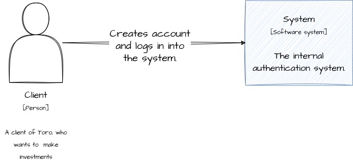
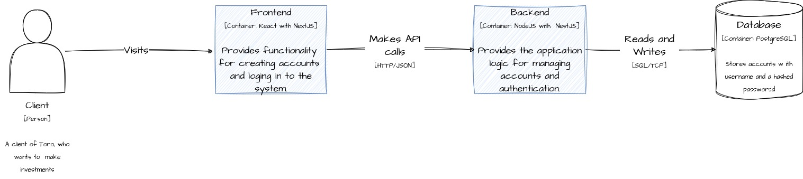

# Toro Test
This app was built while applying for the Toro Fullstack Position.
It implements the user story 001
```
TORO-001 - Eu, como investidor, gostaria de acessar a plataforma Toro usando minhas credenciais de usuário e senha, para que eu possa aprender mais, investir mais e acompanhar meus investimentos.
```

## About the app.
This is a three tier application, with one dedicated app for the frontend, one dedicated app for the backend and one database. It provides basic functionality for a user to login to the platform and access a private route.

In the next sessions, there is a C4 Diagram to give a broader vision about the application.


### C1 - System Context


### C2 - Container Diagram.


### More about the backend and the front end.
Inside each folder there is a specific README discussing design decision, testing strategies, and other things. You can navigate to them using those links:
* [backend](backend/README.md)
* [frontend](frontend/README.md)

## Getting up and running
To get the system up in you machine you need to have `docker` and `docker compose` installed. To start the applications, follow the steps bellow:
1. `make setup`
This will spin up the Postgres container, create the required Database for it, and then stop the container.

2. `make start`
This will spin up the frontend app, the backend app and the postgres database.

You should be good to go by now.
The frontend will be running on __http://localhost:80__ and the backend will be running on __http://localhost:3000__.

## Navigating and using the application
Once you open the browser, you will see the home page. There is no user created in the database at this point, so you won't be able to make a login. You can then create your user. Click on "create account" button at the top right of your screen.

On the form, use a valid email and a password. The password should be at least 8 characters long, contain at least one letter, one lower case character and one upper case character.

Once you create the account, you will be redirected to the "wallet" page (sorry, couldn't thing of any better name). Those are just random numbers, provided by a secure API route. You can logout and try to access /wallet by force, but you will be redirected to the home page. Now you can login with the account you have created, and you will be redirected to the /wallet page again.

## Running the tests
Once the containers are up, you can execute the tests.

To test the backend, run: `make test-backend`.

To test the frontend, run: `make test-frontend`.
