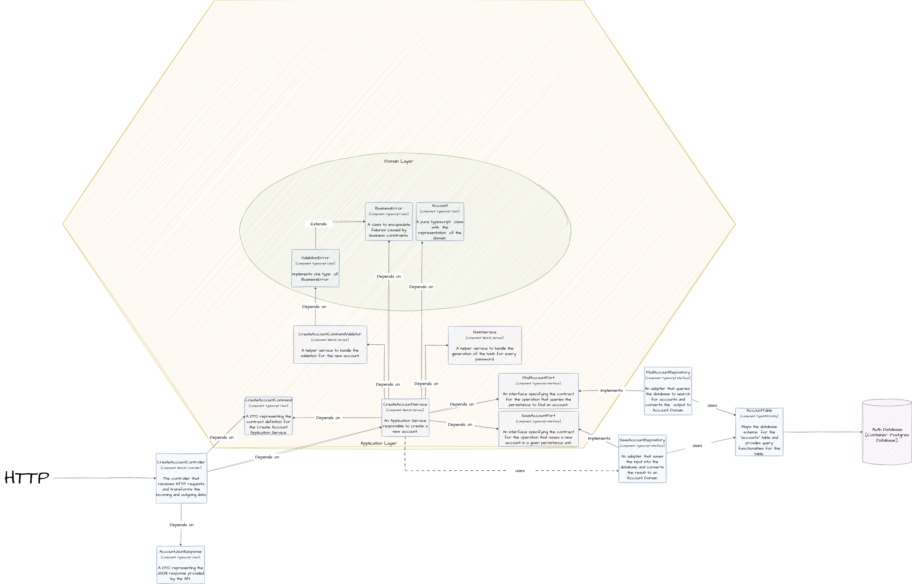

# Toro Test Backend
Here you will find more details about the backend application.

## Frameworks
The app is built with NestJS.

To deal with passwords, hashings, JWTs, I've used bcrypt for hashing and jsonwebtoken for the JWT. I didn't use passport or nest/jwt just to go more "raw" on this test. For a production app I would not try to create my own auth system from zero and would probably use those tools (or other tools, like OAuth) to help with a faster development and a more secure solution.

## Design Decisions
The idea behind this app is to organize it as a "module by feature". Each module should represent a specific domain, and be as independent as possible from other modules. This means that each module would have its own database and a clear boundary so that modules can communicate with each other.

Following this approach, you will find one folder inside the **src** folder: **auth**. This is module responsible for the authentication domain, which is responsible to handle accounts and authenticating the usage of those accounts.

The auth module is organized following a **ports and adapters** pattern, where the each connection to outside world (receiving an HTTP request or accessing a database) is an adapter, that adapts a data model to something that our application can use. This allows us to achieve a good decoupling between our domain and the outside world. The folder structure for the auth module is:
* adapters: here we implement all the adapters that will interact with the outside world. For this test there are two groups of adapters:
  * http adapters: has all the controllers responsible for handling HTTP requests. Those are responsible to deal with HTTP status codes, to parse the incoming data into the data needed by an application service, and providing the correct JSON response.
  * persistance adapters: has all the implementations for the repositories. Those have a model of the database tables that we use, and they are responsible to access the database with the correct SQL and map the database schema to the domain model that we implement in our domain layer.
* applications: those have all the application services, responsible to handle the application use cases like __create account__, or perform a __login__. Inside this folder there are two subfolders:
  * ports: represents the contracts that the adapters must follow. For **income (or driven) ports** we implement custom DTOs, responsible to transfer data from the controller to the application service. For the **outgoing (or drive) ports** we declare interfaces with the functionality that will need. Those interfaces are implemented by the repositories.
  * services: those are auxiliary services to handle specific operations. This helps the application be more tested, and developed in a way that TDD can be easily applied. It also helps to re-use some pieces of logic in different application services.
* domain: those represent domain objects and rules that will help to model the domain data and the domain logic. Although in this implementation the domain is very "anemic" I believe that having a specific layer for the domain helps the application to evolve as things get more complex.

A better visualization of all those layers, how they interact, and how they achieve the decoupling between the outside world and the application is represented by the bellow diagram. It has almost all the classes used in the __create account__ use case.

## Testing Strategy
The application is only unit tested. Those tests were written with development, in TDD style, and they test each component in completely isolation from other components. I didn't add any integration tests because I didn't want to deal with having a different database for those tests given the time constraint for this project.

The app has more than 80% coverage. The only files that have no coverage at all are the ones in the root directory (app.module, main.ts and auth.module.ts). Those files would only be tested in an integrated test. If this was a project to be sent to production, I would recommend adding the integration tests and making them part of the development routine.
ps: by integration test I mean a test where we make a request to a specific endpoint, and receive an answer from it without mocking any code or database access.

## Environment configuration
For the sake of this test I didn't add any environment vars. The database connection is fully hard coded. This would be a very bad decision if we were to deploy this application into multiple environments. Since adding environment variables would require me to create a configuration module that could be injected in my services (so that I don't spread `process.env.ENV_VAR` across the application) I preferred not to add this additional time to the implementation.
